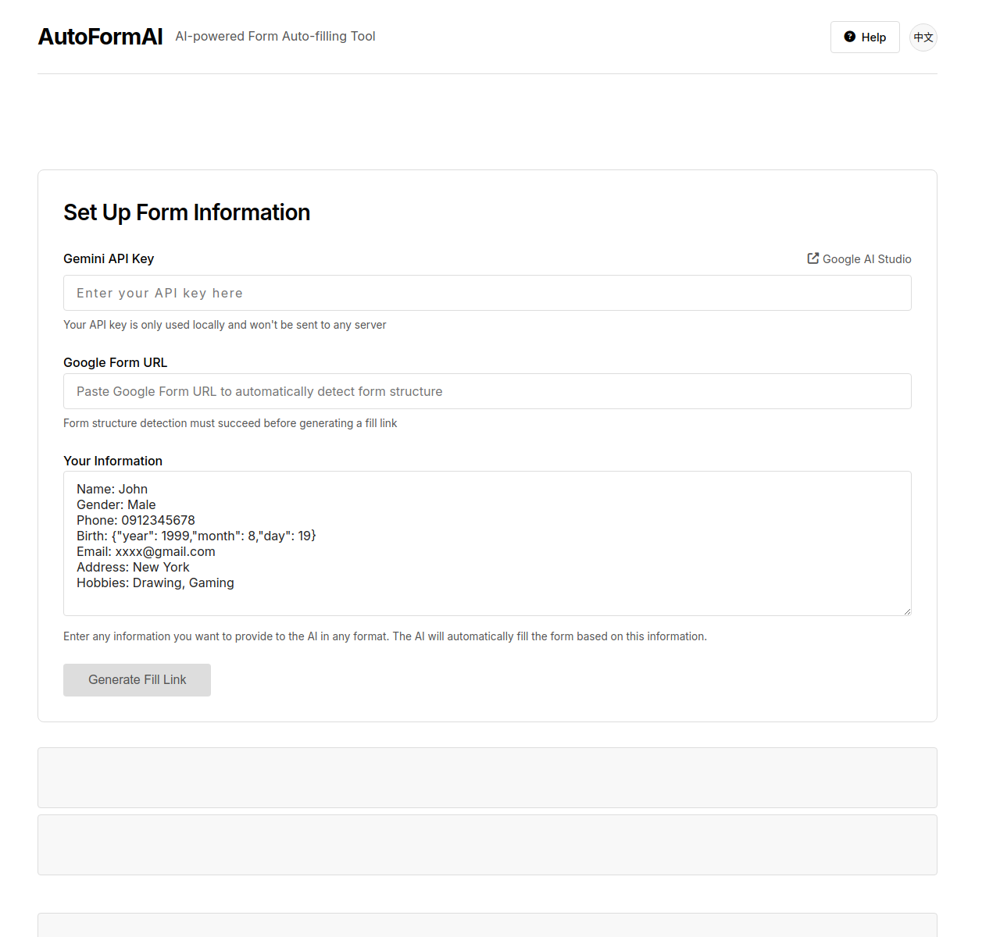

<div align="center">

# 🤖 Google Form AI Auto-Fill Tool

[English](README.md) | [繁體中文](README.zh-TW.md)


[](https://choosealicense.com/licenses/mit/)
[](https://www.python.org/)
[](https://deepmind.google/technologies/gemini/)

An intelligent tool that uses Google Gemini AI to automatically fill out Google Forms.  
Just provide the form URL and basic information to generate a pre-filled URL.

[Features](#features) •
[Quick Start](#quick-start) •
[Usage](#usage) •
[Contributing](#contributing)



</div>

---

## ✨ Features

- 🧠 Use Gemini AI to generate answers
- 🔍 Automatically parse Google Form structure
- 📝 Support multiple question types:
  - Short Answer / Long Answer
  - Multiple Choice / Dropdown
  - Checkbox / Linear Scale
  - Single Choice Grid / Checkbox Grid
  - Date / Time
- 🌐 Fully functional web interface with responsive design
- 🌙 Support for both English and Traditional Chinese languages
- 📱 Optimized for desktop and mobile devices
- 📋 Detailed help page with step-by-step instructions

## 🚀 Quick Start

This tool can be used in two ways: as a pure frontend application or with a Python backend.

### Option A: Pure Frontend Version (No Installation Required)

#### Prerequisites
- A modern web browser (Chrome, Firefox, Edge, etc.)
- A valid [Google AI Studio](https://makersuite.google.com/app/apikey) API key

#### Running the Application
Simply download this repository and open the `index.html` file in your web browser. No server is required.

You can also use:
- Visual Studio Code's "Live Server" extension
- Any static file server (such as Python's `python -m http.server`)

### Option B: Python Version

#### Prerequisites
- Python 3.7 or above
- A valid [Google AI Studio](https://makersuite.google.com/app/apikey) API key

#### Setup
1. Install the required packages:
   ```bash
   cd python
   pip install -r requirements.txt
   ```

2. Configure the Python script:
   - Open `python/ai_form.py` in a text editor
   - Set your Google Form URL and personal information in the script
   - Create a `.env` file in the python directory with your API key:
     ```
     GEMINI_API_KEY=your_api_key_here
     ```

3. Run the script:
   ```bash
   python ai_form.py
   ```

## 📖 Usage

### Frontend Version

1. Enter your Gemini API key
2. Paste a Google Form URL
3. Wait for the form structure to be detected
4. Enter your personal information
5. Click "Generate Link" to get your pre-filled form URL

### Python Version

You can customize the script by modifying:
- The `URL` variable with your Google Form URL
- The `PROMPT_PARTS` list with your personal information

### Custom Information Format
You can format your personal information however you like. Example:
```
Name: John Doe
Gender: Male
Email: example@email.com
Birthdate: {"year": 1990, "month": 5, "day": 15}
Interests: Music, Hiking, Reading
```

## ⚠️ Notes

- Your Gemini API key is only used locally and is never stored or transmitted to any server
- The web version requires successful form structure detection before generating links
- This tool is for educational and research purposes only
- Please comply with Google Form's terms of service

## 🤝 Contributing

We welcome contributions to improve this tool:

1. Fork this project
2. Create a new branch (`git checkout -b feature/amazing-feature`)
3. Commit changes (`git commit -m 'Add amazing feature'`)
4. Push branch (`git push origin feature/amazing-feature`)
5. Open a Pull Request

### Improvement Directions
- Support more question types
- Improve AI accuracy
- Add better error handling for form detection
- Enhance user interface and experience

## 📄 License

This project uses MIT License - see [LICENSE](LICENSE) file

## 📢 Disclaimer

This tool is for educational and research purposes only. Users should assume all risks and comply with relevant laws and regulations.

## 📮 Contact

For any questions or suggestions:
- 🐛 [Open Issue](../../issues)
- 🔀 [Submit Pull Request](../../pulls)
- 📧 Email to [sun055676@gmail.com]

## 🙏 Acknowledgements

- [Google Gemini AI](https://deepmind.google/technologies/gemini/)
- Various CORS proxies for helping with form detection
- Modern web technologies (HTML, CSS, JavaScript)

---

<div align="center">
Made with ❤️ by Sun
</div>
